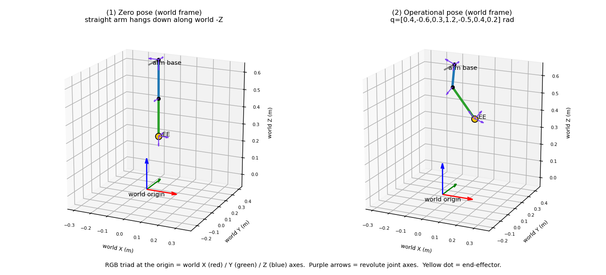
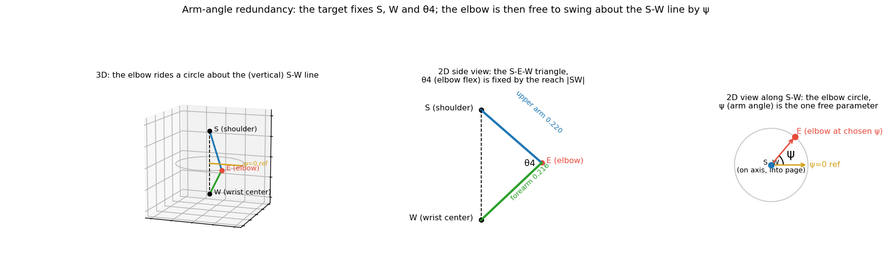

# openarm_model

Rigid-body model of a **7-DOF SRS arm** (spherical shoulder, revolute elbow,
spherical wrist): forward kinematics, a closed-form analytic **inverse
kinematics** solver, and gravity / Coriolis / friction **dynamics**. Pure Rust,
no hardware dependencies, so the whole IK↔FK round-trip runs under `cargo test`.

The kinematics/dynamics are **robot-agnostic**: they derive all geometry from
whatever URDF the caller passes (and reject a non-SRS chain with an error). The
one openarm-specific part, the version-to-(URDF, link names, friction) mapping,
is isolated in the [`description`](src/description.rs) module, so the agnostic
core could be lifted to a shared hub later by moving that module out. It
currently serves the **OpenArm v1.0**.

It is a **library**, used in-process by:

- the arm control loop (gravity/Coriolis/friction feedforward);
- the `kinematics` node, which wraps `solve_ik` / `compute_fk` as services for
  cross-process / cross-language consumers.

This mirrors ROS: the solver is a library (like KDL); `move_group` is the node
that exposes it.

---

## 1. Coordinate frames



There are three frames that matter:

| Frame | Where it is | Transform from parent |
|-------|-------------|-----------------------|
| **world** | global origin | - |
| **body** (`openarm_body_link0`) | torso base | identity (`world == body`) |
| **arm base** (`openarm_left_link0`) | shoulder mount | `xyz = (0, 0.031, 0.698)`, `rpy = (−π/2, 0, 0)` |

- **World origin / orientation.** The world origin coincides with the torso base
  (`world → body` is the identity). Standard right-handed axes, **+Z up**. Both
  panels above are drawn in this frame.
- **Arm base.** The left arm mounts 0.698 m above the world origin and is rolled
  −90° about X. Consequence: the arm base's **+Y** points along the world **−Z**,
  so at the zero configuration the straight arm hangs **straight down** (left
  panel). The right arm is the mirror image, re-derived from the URDF (loaded with
  the right arm's link names), not sign-flipped.
- **The crate's FK/IK math runs in the arm base frame** (`link0`); the figures are
  shown in the world frame only for illustration. The `kinematics` node exposes
  `solve_ik` / `compute_fk` in the **world frame** and converts with the fixed
  mount transform above, so an IPC consumer never handles the base frame directly.
  The side is fixed at node config (there is no per-request frame argument).

### Zero configuration

At `q = 0` the arm is straight. In the **arm base frame** (the frame the math
uses) it extends along **+Y**; in the world frame that direction is −Z (down).
The three SRS centers (in the arm base frame, derived from the joint axes and
verified against the URDF) are:

```
S  (shoulder)  = (0,      0,      0.1225)   joints 1,2,3 concurrent here
E* (elbow)     = (0,      0.220,  0.1225)   on the S-W line
W  (wrist)     = (0,      0.436,  0.1225)   joints 5,6,7 concurrent here
upper arm |S-E*| = 0.220 m     forearm |E*-W| = 0.216 m
```

Revolute axes at `q = 0`, in the arm base frame (purple arrows in the figure):

```
j1 +Z   j2 −X   j3 +Y      (shoulder: a 3-axis spherical joint at S)
j4 −Z                      (elbow flex)
j5 +Y   j6 +X   j7 +Z      (wrist: a 3-axis spherical joint at W)
```

> **Gotcha (handled):** joint 4's URDF *frame origin* sits at `(0, 0.220, 0.091)`,
> 31.5 mm below the S-W line. But joint 4's axis at `q = 0` is **−Z (vertical)**,
> so its axis *line* is `{x = 0, y = 0.220, any z}`, which still passes through the
> elbow point `(0, 0.220, 0.1225)` on the S-W line; the 31.5 mm is *along* the axis
> and does not move the line off it. So it is not a kinematic offset. The model
> works on the axis lines and concurrency points (`model.rs` derives `E*` as the
> joint-4 axis / S-W line intersection), never joint 4's frame origin.

### Units and conventions

- Lengths in **meters**, angles in **radians**.
- Quaternions are **`[x, y, z, w]`**. Non-unit input is normalized.
- Dynamics run in the **world frame** (gravity is world −Z; world ≡ body), so the
  static torso mount orientation is included; it sets how the arm hangs.

---

## 2. Forward kinematics

FK is built from the URDF via the [`k`](https://crates.io/crates/k) crate and
re-expressed in the arm base frame. It is intentionally an **independent**
implementation from the IK (a product of joint transforms), so an IK→FK
round-trip is a genuine correctness test.

---

## 3. Inverse kinematics

The arm is a **clean SRS** (spherical-revolute-spherical) chain: shoulder and
wrist are 3-axis spherical joints, the elbow is a single flex joint, and there
are no link offsets. That structure admits an exact closed-form solution: a small
finite set of discrete branches (see §4) plus one redundant DOF, exposed
explicitly as the **arm angle ψ**.

The solve is **geometric** (steps below): find the wrist center, place the elbow
on its redundancy circle, and read off the joint angles. The single non-obvious
step is splitting the shoulder and wrist rotations into three joint angles each;
that uses a standard, closed-form primitive (the **Paden-Kahan subproblems**) fed
joint axes taken straight from the FK-validated model, so signs and offsets are
correct by construction, no by-hand DH transcription, and the same code serves the
mirror arm and any other SRS URDF. The math and sources are in
[Method and references](#method-and-references) below; you can read the algorithm
without them.

### Why the arm is redundant, and what ψ is

A 6-DOF target pose (position + orientation) constrains 6 of the 7 joints. The
leftover DOF is the **elbow swiveling about the line from the shoulder S to the
wrist center W**. With S, W and the elbow flex `θ4` all fixed by the target, the
elbow is free to ride a **circle** about the S-W line. The angle around that
circle is the arm angle **ψ**, the single free parameter.



### Algorithm (what `solve` does)

Inputs: target pose `(R_d, p_d)`, a seed `q_seed`, and a ψ policy.

1. **Wrist center** `W = p_d` (the EE coincides with the wrist, so the target
   position *is* the wrist center).
2. **Reach check.** Require `|S−W| ∈ [|Lsu−Luw|, Lsu+Luw]`; otherwise the target
   is unreachable and the solver returns `None`.
3. **Elbow flex** `θ4 = acos((|SW|² − Lsu² − Luw²) / (2·Lsu·Luw))`. It depends
   only on reach, so it is fixed before ψ. `θ4 ≥ 0` is unique here because joint
   4's limit is one-sided (there is no elbow-up / elbow-down mirror).
4. **Choose ψ** (resolve the redundancy): `FromSeed` uses the arm angle of the
   seed's elbow; `Fixed(ψ)` uses the caller's value.
5. **Place the elbow** `E(ψ)` on the circle about the S-W line, which fixes the
   shoulder rotation `R_s` and leaves a residual wrist rotation `R_w`.
6. **Decompose** each rotation into joint angles via Paden-Kahan subproblems:
   the shoulder into `θ1..θ3` (≤2 branches) and the wrist into `θ5..θ7`
   (≤2 branches), giving ≤4 candidate configurations.
7. **Select.** Drop any candidate with a joint outside its limit window; of the
   rest, keep the one nearest `q_seed` (each joint compared at its closest
   2π-equivalent). If none are in-limits, return `None`.

Result: `Solution { q, arm_angle }`.

The ψ=0 reference direction on the circle is the coordinate axis **least aligned**
with the S-W line, projected onto the circle plane. That axis is at most ~54.7°
off the plane, so the reference is always well-conditioned and ψ is defined for
every reachable target.

Returned joints are always normalized into their declared limit windows (a `+2π`
alias is mapped back into range), so a solution never reports a value the hardware
would reject.

### Method and references

Step 6 (a rotation into three fixed-axis rotations) and the forward map that
validates the geometry both treat each joint as a **screw**: a rotation about an
axis *line* fixed in the base frame at the home pose. The forward map is then
`exp([S₁]q₁)···exp([S₇]q₇)·M` (a product of exponentials), with the screw data
read directly from the URDF rather than transcribed into DH parameters by hand,
which is what makes signs and offsets correct by construction. The inverse of step
6 is assembled from the **Paden-Kahan subproblems**: the canonical closed-form
inverses of small screw equations (subproblem 1: rotation about one axis carrying
`p` to `q`; subproblem 2: two intersecting axes). These are textbook, not
bespoke:

- Product of exponentials and the Paden-Kahan subproblems: Murray, Li & Sastry,
  *A Mathematical Introduction to Robotic Manipulation* (1994), ch. 3 (free PDF
  from the authors).
- The arm-angle redundancy parameter with joint limits: Shimizu et al.,
  "Analytical Inverse Kinematic Computation for 7-DOF Redundant Manipulators With
  Joint Limits…", *IEEE T-RO* 2008.
- The joint-limit interval formulation and modern subproblem decomposition:
  Elias & Wen, "Redundancy parameterization and inverse kinematics of 7-DOF
  revolute manipulators," [arXiv:2307.13122](https://arxiv.org/abs/2307.13122)
  (*Mech. Mach. Theory*, 2024).

The arm angle ψ here is exactly the **shoulder-elbow-wrist (SEW) angle** of
Elias-Wen / the **arm angle** of Shimizu, the standard names for this redundancy
parameter.

---

## 4. Redundancy resolution, determinism, and elbow flips

These are the subtle questions, so to be precise:

**How is the free parameter chosen?** By the `ArmAnglePolicy`:

- `FromSeed` (default, for servoing): ψ = the arm angle of the **seed**
  configuration. Seed each call with the previous solution and the elbow stays
  where it was, giving continuity.
- `Fixed(ψ)`: use exactly this ψ (e.g. to command a posture); an infeasible ψ
  returns `None`.

**Discrete branches.** Even with ψ and the target fixed, the *same* hand pose can
be reached by more than one set of joint angles. Inverting the shoulder rotation
into `θ1..θ3` has up to two solutions (the two roots of the Paden-Kahan
subproblem, geometrically a "flip" of the spherical joint through the arm plane),
and likewise the wrist into `θ5..θ7`. That gives up to **2 × 2 = 4** distinct
configurations that all hit the target (`θ4` is unique, since joint 4's limit is
one-sided). The solver keeps the in-limits one **nearest the seed** in joint
space (each joint compared at its closest 2π-equivalent).

**Is it deterministic?** **Yes, per call.** `solve` is a pure function: identical
`(target, ψ-policy, seed)` always yield the identical result. There is no
randomness, no internal state, no time dependence.

**Is it path-/approach-dependent?** A **single** call is not; it depends only on
its inputs, not on how the target was reached. Across a **trajectory** it is, **by
design**: in `FromSeed` mode each step's seed is the previous solution, so the
result is history-dependent, which is exactly what produces continuity. For a
fully approach-independent mapping use `Fixed(ψ)` with a constant ψ *and* a
constant seed (at the cost of possible jumps near branch boundaries).

**Can it suddenly flip the elbow?** Not during normal continuous servoing: seed
with the previous solution, keep `FromSeed`, and both ψ and the nearest discrete
branch vary continuously (no swing, no flip). It **can** jump when:

1. you do **not** seed with the previous solution (each call is independent, so a
   far seed can select a different branch);
2. the path crosses a **singularity**: the straight-arm boundary (`|SW| → 0.436`,
   where the elbow circle collapses) or a wrist alignment, where branches merge
   and the nearest-seed choice can swap;
3. the current branch runs into a **joint limit** and a different branch becomes
   the nearest feasible one (or none is, returning `None`).

The solver does **not** itself bound the per-step joint change or veto a flip;
that is the caller's job (seed with the previous `q`; optionally reject a solution
whose joint-space distance from the seed exceeds a threshold and re-plan or slow
down). So: **continuity by seeding, with the usual singular / joint-limit
caveats**, rather than an unconditional no-flip guarantee.

---

## 5. Dynamics

`dynamics::{gravity, coriolis, friction}` give per-joint feedforward torques for
the control loop:

- `gravity`: moment balance against gravity (world −Z).
- `coriolis`: `C(q,q̇)·q̇` via a world-frame Recursive Newton-Euler pass
  (`q̈ = 0`, gravity off); no mass matrix is formed.
- `friction`: a tanh model; the constants are supplied by the caller (the
  `description` module holds the OpenArm values, the same for the leader and
  follower arms, from openarm_teleop's config).

Gravity and Coriolis are validated against **KDL** `ChainDynParam` reference
values to < 1e-3 N·m.

> The left and right arms are mirror images, so their gravity/Coriolis torques
> differ at the same joint angles; load the model for the correct arm (the
> description layer / arm node selects the side from its `arm_side` parameter).

---

## 6. Testing

`cargo test` (no hardware) covers:

- IK→FK round-trip over thousands of seeded-random samples (< 1e-6 m / < 1e-6
  rad), self-consistency, an arm-angle sweep, and the right-arm mirror;
- a Cartesian-trajectory servo (a smooth closed path solved in `FromSeed` mode,
  seeding each step with the previous solution) asserting smooth, flip-free joint
  motion;
- the independent screw forward map ≡ k-chain FK cross-check;
- direct unit tests for the subproblems, angle wrapping, limit normalization,
  and the geometry helpers;
- gravity/Coriolis vs KDL reference values.

```
cargo test            # all of the above
cargo test round_trip # just the IK↔FK round-trip
```

The diagrams in `docs/` are produced by `docs/gen_diagrams.py` (matplotlib + numpy);
re-run it to regenerate them.
